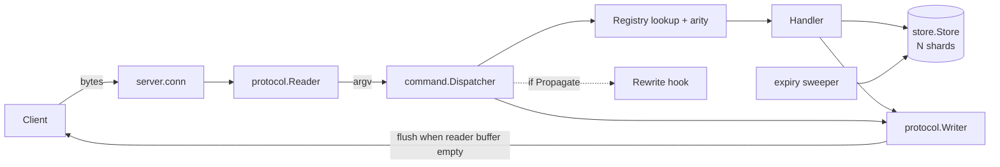

# Architecture

## Components

| Package             | Responsibility                                                                          |
| ------------------- | --------------------------------------------------------------------------------------- |
| `internal/protocol` | RESP2 `Reader` (arrays of bulk strings, inline commands, all RESP2 types) and `Writer`  |
| `internal/store`    | Sharded typed keyspace: values, expiry index and sweeper, `Clock`, `Scan`, glob matcher |
| `internal/list`     | List value: ring-buffer deque                                                           |
| `internal/hash`     | Hash value: insertion-ordered slice plus position map                                   |
| `internal/set`      | Set value: member slice plus position map (O(1) random member)                          |
| `internal/zset`     | Sorted-set value: skip list with spans plus member map                                  |
| `internal/command`  | `Registry`, `Dispatcher`, command handlers, `Context`, `Rewrite` hooks                  |
| `internal/server`   | TCP accept loop, per-connection loop, graceful shutdown                                 |
| `internal/config`   | Defaults, validation, flag/env loading                                                  |
| `cmd/sylphy-server` | Wiring, logging, signal handling, store sweeper lifecycle                               |

Dependencies point inward: `server` → `command` → (`store` via interface, `protocol`).
The value packages import `store` (for `Kind`, `Value`, `Collection`) and
`command` imports them; `store` knows nothing about concrete collection types.
`command` depends on a small `Store` interface, so handlers are tested against a
real small store with a fake clock.



## Request lifecycle

1. The connection goroutine arms the idle read deadline (only if the reader
   buffer is empty) and calls `Reader.ReadCommand`.
2. The reader parses a RESP array of bulk strings or an inline line into `argv`.
3. `Dispatcher.Dispatch` looks up the command case-insensitively, checks arity,
   and runs the handler with `argv[1:]`.
4. The handler reads/writes the store and appends its reply to the `Writer`
   buffer. Returned `*ReplyError`s become RESP errors; `store.ErrWrongType`
   becomes `WRONGTYPE`; other errors become `ERR internal error` and are logged.
5. If `Context.Propagate` is set and the command was a successful write,
   `Dispatch` leaves its deterministic form in `Context.Rewritten` (see
   [ADR-018](DESIGN_DECISIONS.md#adr-018-rewrite-hooks-for-a-future-append-only-log)).
6. If `Reader.Buffered() == 0` the writer is flushed — one syscall for a whole
   pipelined batch. Otherwise the loop continues with the next buffered request.
7. Protocol/limit errors write `-ERR Protocol error: ...`, flush, and close the
   connection. `QUIT` flushes and closes.

## Value model

```text
store.Value        Kind() Kind                      string, list, hash, set, zset
store.Collection   Value + Len() int                list, hash, set, zset
```

A key maps to one `Value`. Handlers never hold a collection outside a closure:
`View` (read lock), `Mutate` (write lock, returns the new value), `MutateEntry`
(write lock plus TTL access) and `Atomic`/`AtomicView` (several keys) run the
handler's function under the shard lock. Returning `nil` or an emptied
`Collection` from `Mutate`, or calling `Entry.Put` with one, deletes the key and
its TTL. A wrong-kind value yields `store.ErrWrongType`, which the dispatcher
turns into `WRONGTYPE`. See [ADR-010](DESIGN_DECISIONS.md#adr-010-typed-values-and-closure-based-access).

Handlers copy what they need out of the closure and write their reply after it
returns, so a slow client can never hold a shard lock.

| Value  | Structure                                 | Why                                                                                                      |
| ------ | ----------------------------------------- | -------------------------------------------------------------------------------------------------------- |
| string | `[]byte`                                  | binary-safe, copied in and out                                                                           |
| list   | ring-buffer deque                         | O(1) both ends and by index ([ADR-013](DESIGN_DECISIONS.md#adr-013-ring-buffer-lists))                   |
| hash   | entry slice + `map[field]position`        | O(1) ops, deterministic order                                                                            |
| set    | member slice + `map[member]position`      | O(1) uniformly random member for `SPOP`/`SRANDMEMBER`                                                    |
| zset   | skip list with spans + `map[member]score` | O(log n) rank/range/insert ([ADR-014](DESIGN_DECISIONS.md#adr-014-skip-list-with-spans-for-sorted-sets)) |

## Expiry subsystem

Deadlines are absolute Unix milliseconds. Each shard has an `exp` index
(`key → deadline`, always a subset of the shard's keys) next to its value map.

- **Lazy expiry.** Every access compares the key's deadline with the store clock.
  A read path that finds an expired key reaps it under the write lock and then
  reads again; `Delete`, `Exists`, `Len`, `Keys`, `Scan` and `AtomicView` never
  return expired keys. A deadline equal to "now" is still alive.
- **Active expiry.** A sweeper goroutine, started by `Store.Start`, wakes every
  `TickInterval` (100 ms). For each shard it samples up to `SampleSize` (20)
  keys from the expiry index and deletes the expired ones; if more than
  `StaleThreshold` (25%) of a sample was expired it samples the same shard
  again. A cycle stops after `CycleBudget` (25 ms) of real time so the sweeper
  never starves writers. Keys nobody reads are therefore reclaimed in bounded
  time, and the share of dead keys stays near the threshold.
- **Counters.** `Store.Stats` reports lazy and active expirations and completed
  sweeper cycles.
- **Time.** All decisions use the injected `Clock`; the sweeper's budget uses
  the real wall clock because it bounds CPU time. See
  [ADR-011](DESIGN_DECISIONS.md#adr-011-expiry-lazy-checks-plus-sampled-active-sweeping)
  and [ADR-012](DESIGN_DECISIONS.md#adr-012-injectable-clock).

## Concurrency model

- **One goroutine per connection**, tracked by a `WaitGroup` and a set guarded
  by `Server.mu`. `recover()` at the connection boundary isolates panics.
- **Store**: N shards, each with its own `RWMutex`. Single-key operations hold
  one shard lock. Operations that need several keys (`Atomic`, `AtomicView`:
  `SMOVE`, the `*STORE` set commands, `RENAME`) lock the involved shards in
  **ascending shard-index order**, each shard once, so no cycle of waiting
  goroutines can form ([ADR-015](DESIGN_DECISIONS.md#adr-015-ascending-shard-lock-ordering)).
  The sweeper, `Scan`, `RandomKey`, `Keys` and `Flush` hold one lock at a time;
  `Keys` and `Scan` snapshot names under a shard read lock and filter outside it.
- **Registry** is immutable after startup (lock-free reads).
- **Shutdown**: `closing` is set under `mu` before the listener is closed;
  `admit` checks it under the same lock before `wg.Add`, so `Add` never races
  `Wait`. Draining sets a past read deadline on every connection (guarded by a
  per-connection mutex so the idle-timer update can't overwrite it). After the
  grace period remaining sockets are force-closed. `main` closes the store after
  the server has stopped, which stops the sweeper.

## Goroutine ownership

| Goroutine       | Owner                     | Exits when                                                    |
| --------------- | ------------------------- | ------------------------------------------------------------- |
| accept loop     | `Serve` (waits on it)     | listener closed                                               |
| connection      | `Server.wg`               | peer closes, error, drain deadline, force close               |
| shutdown waiter | `Shutdown`                | `wg.Wait` returns                                             |
| expiry sweeper  | `Store` (`Start`/`Close`) | `Store.Close` (waits on it); `Start` after `Close` is a no-op |

`Store.Close` is idempotent, safe without `Start`, and leaves the store usable
(without active expiry). Integration tests assert that no goroutine outlives the
server and store.

## SCAN

`SCAN` walks shards in ascending index order and each shard's key slots from
high to low; the cursor packs the shard and the number of unvisited slots, so
the server keeps no iteration state. Cost per call is O(`COUNT` + shards). See
[ADR-016](DESIGN_DECISIONS.md#adr-016-scan-cursor-over-shards-and-key-slots).

## Hooks for later phases

- `Spec.Rewrite`, `Context.Propagate` and `Context.Rewritten` give Phase 3 a
  deterministic command stream (ADR-018).
- `Context` and `ConnState` are where transaction and subscription state will go
  in Phase 4; handlers only ever see `*Context`.
