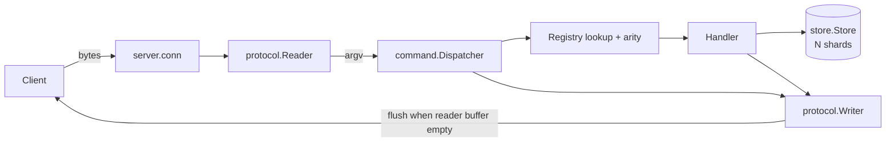

# Architecture

## Components

| Package             | Responsibility                                                                         |
| ------------------- | -------------------------------------------------------------------------------------- |
| `internal/protocol` | RESP2 `Reader` (arrays of bulk strings, inline commands, all RESP2 types) and `Writer` |
| `internal/store`    | Sharded `map[string][]byte`, glob matcher, atomic `Update`                             |
| `internal/command`  | `Registry`, `Dispatcher`, command handlers, `Context`                                  |
| `internal/server`   | TCP accept loop, per-connection loop, graceful shutdown                                |
| `internal/config`   | Defaults, validation, flag/env loading                                                 |
| `cmd/sylphy-server` | Wiring, logging, signal handling                                                       |

Dependencies point inward: `server` → `command` → (`store` via interface, `protocol`).
`command` depends on a small `Store` interface, so handlers are tested with a fake.

## Request lifecycle

1. The connection goroutine arms the idle read deadline (only if the reader
   buffer is empty) and calls `Reader.ReadCommand`.
2. The reader parses a RESP array of bulk strings or an inline line into `argv`.
3. `Dispatcher.Dispatch` looks up the command case-insensitively, checks arity,
   and runs the handler with `argv[1:]`.
4. The handler reads/writes the store and appends its reply to the `Writer`
   buffer. Returned `*ReplyError`s become RESP errors; other errors become
   `ERR internal error` and are logged.
5. If `Reader.Buffered() == 0` the writer is flushed — one syscall for a whole
   pipelined batch. Otherwise the loop continues with the next buffered request.
6. Protocol/limit errors write `-ERR Protocol error: ...`, flush, and close the
   connection. `QUIT` flushes and closes.

## Concurrency model

- **One goroutine per connection**, tracked by a `WaitGroup` and a set guarded
  by `Server.mu`. `recover()` at the connection boundary isolates panics.
- **Store**: N shards, each with its own `RWMutex`. No operation holds two shard
  locks, so there is no lock ordering to violate. `Keys` snapshots names under a
  shard read lock and matches outside it.
- **Registry** is immutable after startup (lock-free reads).
- **Shutdown**: `closing` is set under `mu` before the listener is closed;
  `admit` checks it under the same lock before `wg.Add`, so `Add` never races
  `Wait`. Draining sets a past read deadline on every connection (guarded by a
  per-connection mutex so the idle-timer update can't overwrite it). After the
  grace period remaining sockets are force-closed.

## Goroutine ownership

| Goroutine       | Owner                 | Exits when                                      |
| --------------- | --------------------- | ----------------------------------------------- |
| accept loop     | `Serve` (waits on it) | listener closed                                 |
| connection      | `Server.wg`           | peer closes, error, drain deadline, force close |
| shutdown waiter | `Shutdown`            | `wg.Wait` returns                               |
